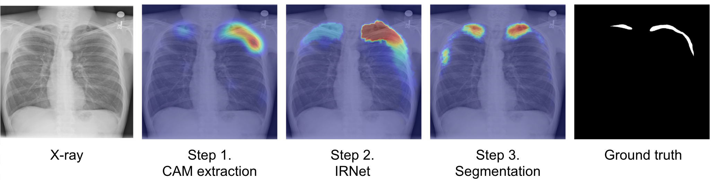

# Weakly Supervised Medical Images Segmentation

This is an implementation of the [Weakly-Supervised Segmentation for DiseaseLocalization in Chest X-Ray Images](https://github.com/ucuapps/WSMIS) by Ostap Viniavskiy, Maria Dobko, and Oles Dobosevych.


## Overview
We proposed a three-step approach to weakly-supervised semantic segmentation, which uses only 
image-level labels as supervision. The method can be applied to various medical problems as well
as on datasets of different nature. We demonstrated the efficiency of this approach for semantic 
segmentation of Pneumothorax on chest X-ray images (SIIM-ACR Pneumothorax). We also evaluated the performance on PASCAL 
VOC 2012 dataset. 


<p align="center"></p>


## License

WSMIS is released under the [GNU General Public License version 3 license](LICENSE).

## General Pipeline
* Step 1. **Cam extraction.** 
    * A fully-supervised classification model (ResNet50 or VGG16) is trained on image-level labels. Grad-CAM++ is used to generate activation maps.
* Step 2. **Boundaries improvements via IRNet.** 
    * IRNet takes the generated CAM from Step 1. and trains ResNet50 with two output branches that predict a displacement vector field and a class boundary map, correspondingly.
* Step 3. **Segmentation.** 
    * Outputs from Step 2 are used as pseudo-labels for training a fully-supervised segmentation model (DeepLabv3+ or U-Net).

Some postprocessing techniques are applied in between the steps, please refer to the paper for details.

## Data
#### Download PASCAL VOC 2012 devkit
* Follow instructions in http://host.robots.ox.ac.uk/pascal/VOC/voc2012/#devkit
#### Download SIIM-ACR Pneumothorax
* Follow instructions in https://www.kaggle.com/c/siim-acr-pneumothorax-segmentation/data

## Usage

### Dependencies and Computing resources

All necessary modules are in the requirements.txt
```
pip install -r requirements.txt
```

This code should be compatible with Python versions \>= 3.5.

All the experiments were performed on four Nvidia Tesla K80 GPUs. 

### Training
1. Set parameters for the experiment config.yaml (for detailed explanation of the config file see config section below)
2. Run the following command:
```
python train.py
```

### Configurations
The description of possible configurations for training is provided in `model_training/CONFIGURATIONS.md`

### Testing
Will be added soon

## Citation

## References
* Learning Deep Features for Discriminative Localization: [paper](http://cnnlocalization.csail.mit.edu/Zhou_Learning_Deep_Features_CVPR_2016_paper.pdf)
* Weakly Supervised Learning of Instance Segmentation with Inter-pixel Relations: [paper](https://arxiv.org/abs/1904.05044)
* U-Net: Convolutional Networks for Biomedical Image Segmentation: [paper](https://arxiv.org/abs/1505.04597)
* Encoder-Decoder with Atrous Separable Convolution for Semantic Image Segmentation: [paper](https://arxiv.org/abs/1802.02611)
